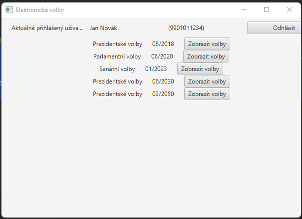
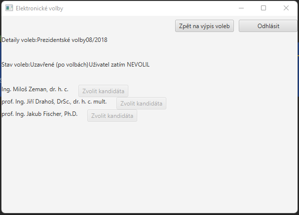

# electronic-voting
Application for electronic voting.

Written in Java, UI made in JavaFX, built in Maven.
Data stored localy using SQLite.

### Sign in screen

### Sign up screen

### Main screen

### Voting screen

